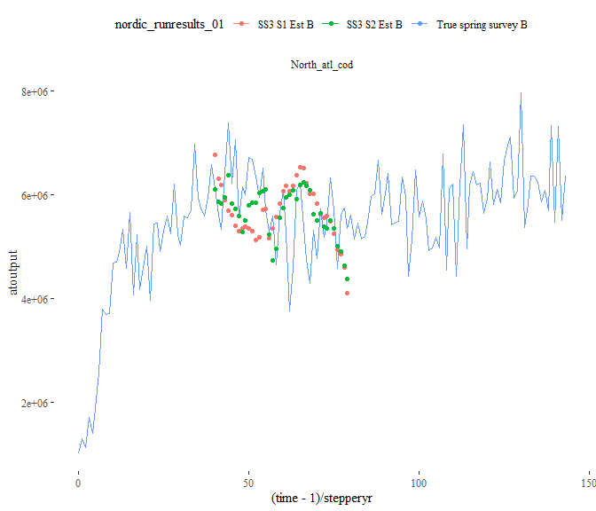
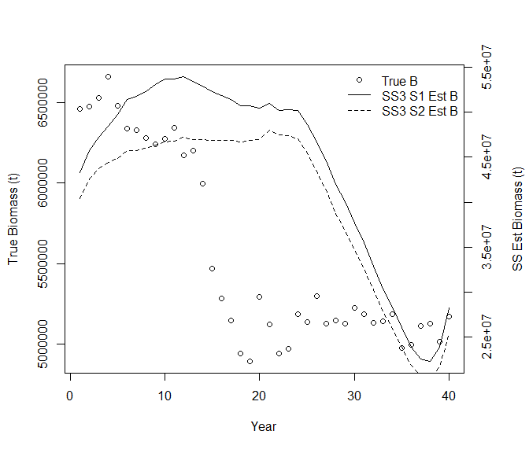
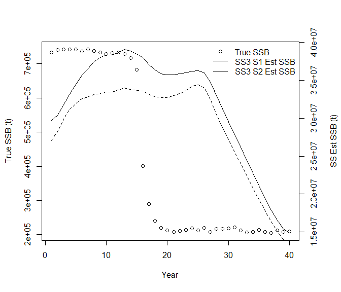
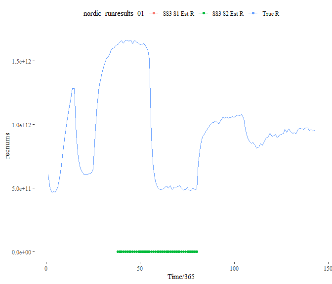
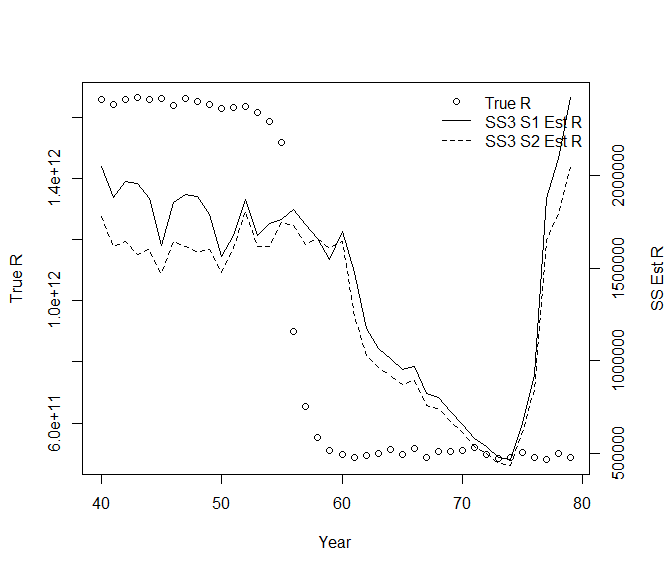
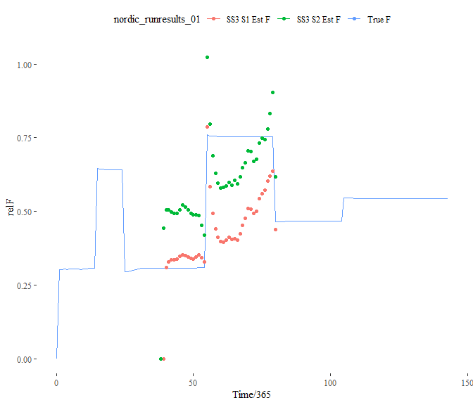
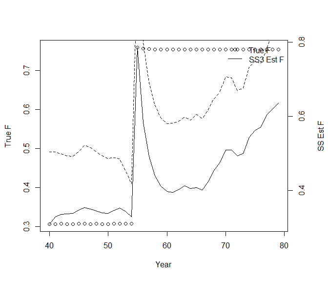
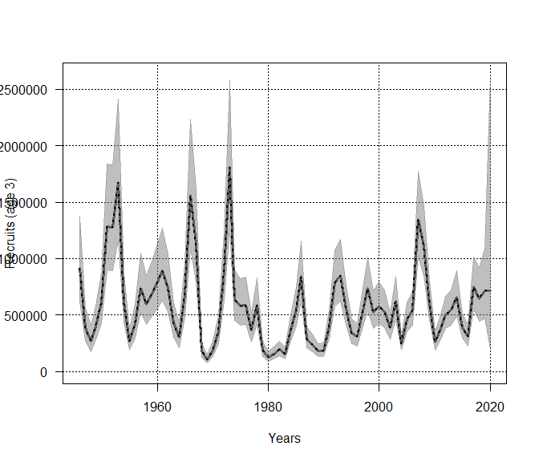

### NOBA Cod atlantisom2ss conversion

#### Workflow

-   Put `NOBA_sacc_30` folder (Atlantisom output) in the
    `NOBA_cod_files/` folder

-   Modify `NOBA_cod_files/Rscript/NOBACOD_atlantisom2SS.R` to convert
    Atlantisom output to SS input. The NOBACOD\_atlantisom2SS.R helps
    generate SS input files for the NOBA\_cod\_files/output/atlanis2ss
    scenario. For scenarios that use depletion-based reduction analysis
    (NOBA\_cod\_files/output/atlantis2ss\_depletion) and consider
    initial equilibrium catch
    (NOBA\_cod\_files/output/atlantis2ss\_initial\_equilibrium\_catch),
    we modified the input data following the instructions from the
    [Stock Synthesis User
    Manual](https://nmfs-stock-synthesis.github.io/ss-documentation/SS330_User_Manual.html).

-   We explored five scenarios and the Stock Synthesis input files for
    each scenario can be found under NOBA\_cod\_files/output folder

    -   atlantis2ss\_full\_data that uses fishery and survey age
        composition data. Model had strong patterns in age composition
        residuals and large final gradient value of 6.88787e+08. The
        estimation model did not converge after trying different
        stock-recruitment models, input values of steepness and standard
        deviation of the recruitment deviation in log space, and
        selectivity patterns.

    -   atlantis2ss\_surveyagecomp that uses survey age composition data
        but not fishery age composition data. Model still did not fit
        well.

    -   atlantis2ss that uses fishery age composition data but not
        survey age composition data. Model had a better final gradient
        value and fit. The expected landings, landing age compositions,
        and survey indices match well with the true values from
        Atlantis. However, the estimated biomass, spawning stock
        biomass, recruitment, and fishing mortality still did not line
        up with the true values from Atlantis.

    -   atlantis2ss\_depletion that adds another survey fleet that takes
        SSB as its input. The target depletion was set to 0.5 in the end
        year. Rick Methot thinks this feature should routinely be used
        in all SS3 configurations. Rick’s insights:

        -   The data show near constant catch for the entire time series
            and the survey also shows little trend. So little surprise
            that scale is hard to get right.
        -   Given that your model has no initial equilibrium catch
            (catch with year = -999), the SS3 model time series is
            assuming that the population is virgin in the start year
            (40).
        -   Then with no trend in the index data, SS3 is getting all
            scale info from the composition data. But the composition
            data show 70% of the fish in the first age bin, beginning
            in 40. So there is no contrast here either. It seems the
            Atlantis is generating a population that is already highly
            depleted by year 40, then SS3 starts in year 40 and is told
            that the population is virgin going into year 40. Please see
            thoughts from Rick and Ian Taylor from [the post on SS3
            public
            forums](https://vlab.noaa.gov/web/stock-synthesis/public-forums/-/message_boards/message/19365724?_com_liferay_message_boards_web_portlet_MBPortlet_orderByCol=modified-date&_com_liferay_message_boards_web_portlet_MBPortlet_scStart=0&_com_liferay_message_boards_web_portlet_MBPortlet_delta=50&_com_liferay_message_boards_web_portlet_MBPortlet_orderByType=desc&_com_liferay_message_boards_web_portlet_MBPortlet_index=0&_com_liferay_message_boards_web_portlet_MBPortlet_scEnd=50&_com_liferay_message_boards_web_portlet_MBPortlet_resetCur=false&_com_liferay_message_boards_web_portlet_MBPortlet_categoryId=971356&_com_liferay_message_boards_web_portlet_MBPortlet_cur1=1).

    -   atlantis2ss\_initial\_equilibrium\_catch that has initial
        equilibrium catches in the data.ss and a short parameter setup
        line (fishing mortality) for initial equilibrium catches in the
        control.ss.

The figures below show comparisons among Atlantis true values, output
values from the atlantis2ss\_depletion scenario S1, and output values
from the atlantis2ss\_initial\_equilibrium\_catch scenario S2 (work in
progress). Will make a pull request and move everything back to Sarah’s
repository after talking to Cecilie.

<!-- --><!-- --><!-- --><!-- --><!-- --><!-- --><!-- --><!-- --><!-- --><!-- -->

### NOBA Cod SAM2SS conversion

In this example, we convert NOBA Cod State-space assessment model (SAM)
inputs to Stock Synthesis (SS) inputs and compare the outputs from the
two packages.

#### Install and library packages

``` r
# install.packages("here")
# 
# install_64bit <- TRUE
# 
# if (install_64bit) {
#   args <- c("--no-multiarch")
# } else {
#   args <- c("")
# }
# 
# devtools::install_github("fishfollower/SAM/stockassessment", INSTALL_opts = args)
# 
# remotes::install_github("r4ss/r4ss", branch = "development")
# 
# remotes::install_github("Bai-Li-NOAA/saconvert") # Need to install "kellijohnson-NOAA/saconvert" after doing pull request.
# 
# remotes::install_github("nmfs-general-modeling-tools/nmfspalette")

library(here)
library(stockassessment) # For using SAM
library(r4ss) # For using SS
library(saconvert)
library(nmfspalette)
```

#### Read SAM input data and run SAM

``` r
sam_input_path <- here::here("NOBA_cod_files", "NEAcod-2020", "data")

# Read in data files
regdat <- grep(".dat",list.files(sam_input_path))
filenames_ICES <- list.files(sam_input_path)[regdat]

#All objects are now on input_file_list
input_file_list <- lapply(file.path(sam_input_path,filenames_ICES), read.ices)
names(input_file_list) <- gsub(".dat","",filenames_ICES)

#Load into function environment as objects
list2env(input_file_list, environment())

# Create a collected data object
sam_dat <- setup.sam.data(
  surveys = survey,
  residual.fleet = cn,
  prop.mature = mo,
  stock.mean.weight = sw,
  catch.mean.weight = cw,
  dis.mean.weight = dw,
  land.mean.weight = lw,
  prop.f = pf,
  prop.m = pm,
  natural.mortality = nm,
  land.frac = lf
)

# Generate a default/minimalistic model configuration
sam_conf <- defcon(sam_dat)

# Generate default initial values for all our model parameters
sam_par <- defpar(sam_dat, sam_conf)

# Fit the SAM model
sam_fit <- sam.fit(sam_dat, sam_conf, sam_par, silent=TRUE)
```

#### Plot SAM fits

``` r
par(mfrow = c(1, 1))
ssbplot(sam_fit)
```

<!-- -->

``` r
fbarplot(sam_fit)
```

<!-- -->

``` r
recplot(sam_fit)
```

<!-- -->

``` r
catchplot(sam_fit)
```

<!-- -->

#### Convert SAM inputs to SS inputs

``` r
# Set up two scenarios
# Scenario A: use selectivity pattern 20 and F method 3 in SS
# Scenario B: use selectivity pattern 20 and F method 2 in SS

scenario_path <- c("A", "B")
slx_pattern <- c(20, 20)
f_method <- c(3, 2)


for (scenario_id in seq_along(scenario_path)){
  output_path <- here::here("NOBA_cod_files", "output", scenario_path[scenario_id])
  if(!dir.exists(output_path)) dir.create(output_path)
  
  saconvert::ICES2SS(
    user.wd = sam_input_path,
    user.od = output_path,
    ices.id = "",
    tvslx = FALSE,
    ages = NULL,
    nsexes = 1, # 1: one sex; 2: two sex; -1: one sex and multiply the spawning biomass by the fraction female in the control file
    forN = 2,
    q.extra.se = FALSE,
    q.float = FALSE,
    slx = slx_pattern[scenario_id],
    f.method = f_method[scenario_id]
  ) # steep.init: http://sedarweb.org/docs/wpapers/SEDAR19_DW_06_SteepnessInference.pdf
  
}
```

#### Compare SAM outputs and SS outputs

``` r
sam_output <- data.frame(
  "Year" = c(sam_dat$years),
  "SSB" = exp(sam_fit$sdrep$value[names(sam_fit$sdrep$value) %in% "logssb"]),
  "Recruits" = exp(sam_fit$sdrep$value[names(sam_fit$sdrep$value) %in% "logR"]),
  "F" = exp(sam_fit$sdrep$value[names(sam_fit$sdrep$value) %in% "logfbar"]),
  "Catch" = c(exp(sam_fit$sdrep$value[names(sam_fit$sdrep$value) %in% "logCatch"]), NA)
)

ss_output <- list()
for (scenario_id in seq_along(scenario_path)) {
  ss_output_path <- here::here("NOBA_cod_files", "output", scenario_path[scenario_id])
  ss_output_data <- SS_output(dir = ss_output_path, verbose = T, printstats = T)
  ss_output[[scenario_id]] <- data.frame(
    "Year" = sam_output$Year,
    "SSB" = ss_output_data$timeseries$SpawnBio[ss_output_data$timeseries$Yr %in% sam_output$Year],
    "Recruits" = ss_output_data$timeseries$Recruit_0[ss_output_data$timeseries$Yr %in% (sam_output$Year - 1)],
    "F" = ss_output_data$timeseries$`F:_1`[ss_output_data$timeseries$Yr %in% sam_output$Year],
    "Catch" = ss_output_data$timeseries$`sel(B):_1`[ss_output_data$timeseries$Yr %in% sam_output$Year]
  )
}
```

    ##                        TempFile                            Size 
    ## "size of file gradfil1.tmp = 0" "size of file gradfil2.tmp = 0" 
    ##                            <NA>                            <NA> 
    ## "size of file varssave.tmp = 0"  "size of file cmpdiff.tmp = 0" 
    ## $SS_version
    ## [1] "3.30.16.02;_2020_09_21;_safe;_Stock_Synthesis_by_Richard_Methot_(NOAA)_using_ADMB_12.2"
    ## 
    ## $SS_versionshort
    ## [1] "3.30"
    ## 
    ## $SS_versionNumeric
    ## [1] 3.3
    ## 
    ## $StartTime
    ## [1] "StartTime: Tue Jun 15 13:31:08 2021"
    ## 
    ## $RunTime
    ## [1] "0 hours, 3 minutes, 36 seconds."
    ## 
    ## $Files_used
    ## [1] "Data_File: data.ss Control_File: control.ss"
    ## 
    ## $Nwarnings
    ## [1] 0
    ## 
    ## $warnings
    ## [1] "#V3.30.16.02;_2020_09_21;_safe;_Stock_Synthesis_by_Richard_Methot_(NOAA)_using_ADMB_12.2"                               
    ## [2] "#Stock Synthesis (SS) is a work of the U.S. Government and is not subject to copyright protection in the United States."
    ## [3] "#Foreign copyrights may apply. See copyright.txt for more information."                                                 
    ## [4] "Tue Jun 15 13:31:07 2021"                                                                                               
    ## [5] ""                                                                                                                       
    ## [6] " N warnings: 0"                                                                                                         
    ## 
    ## $likelihoods_used
    ##                                            values lambdas
    ## TOTAL                                359.18600000      NA
    ## Catch                                  0.00675988      NA
    ## Equil_catch                            0.00000000      NA
    ## Survey                               -61.58670000      NA
    ## Age_comp                             408.25600000      NA
    ## Recruitment                           11.28480000     1.0
    ## InitEQ_Regime                          0.00000000     1.0
    ## Forecast_Recruitment                   0.00000000     1.0
    ## Parm_priors                            1.04272000     1.0
    ## Parm_softbounds                        0.00203150      NA
    ## Parm_devs                              0.00000000     1.0
    ## F_Ballpark                             0.17988800     1.0
    ## F_Ballpark(info_only)_1946_estF_tgtF   0.16467400     0.3
    ## Crash_Pen                              0.00000000     1.0
    ## 
    ## $likelihoods_laplace
    ##                                       values lambdas
    ## NoBias_corr_Recruitment(info_only)   2.27393       1
    ## Laplace_obj_fun(info_only)         350.17500      NA
    ## 
    ## $likelihoods_by_fleet
    ##               Label          ALL      fleet1 FLT15:NorBarTrSur
    ## 182    Catch_lambda           NA 1.00000e+00            1.0000
    ## 183      Catch_like   0.00675988 6.75988e-03            0.0000
    ## 184 Init_equ_lambda           NA 0.00000e+00            1.0000
    ## 185   Init_equ_like   0.00000000 0.00000e+00            0.0000
    ## 186     Surv_lambda           NA 0.00000e+00            1.0000
    ## 187       Surv_like -61.58670000 0.00000e+00          -21.3670
    ## 188      Surv_N_use           NA 0.00000e+00           39.0000
    ## 189     Surv_N_skip           NA 0.00000e+00            1.0000
    ## 190      Age_lambda           NA 1.00000e+00            1.0000
    ## 191        Age_like 408.25600000 1.96057e+02           55.7388
    ## 192       Age_N_use           NA 7.40000e+01           39.0000
    ## 193      Age_N_skip           NA 0.00000e+00            1.0000
    ##     FLT16:NorBarLofAcSur FLT18:RusSweptArea FLT007:Ecosystem_2018corr
    ## 182               1.0000             1.0000                   1.00000
    ## 183               0.0000             0.0000                   0.00000
    ## 184               1.0000             1.0000                   1.00000
    ## 185               0.0000             0.0000                   0.00000
    ## 186               1.0000             1.0000                   1.00000
    ## 187             -13.7443           -18.3018                  -8.17354
    ## 188              35.0000            35.0000                  14.00000
    ## 189               1.0000             0.0000                   0.00000
    ## 190               1.0000             1.0000                   1.00000
    ## 191              67.4602            69.7808                  19.21880
    ## 192              35.0000            35.0000                  14.00000
    ## 193               1.0000             0.0000                   0.00000
    ## 
    ## $N_estimated_parameters
    ## [1] 104
    ## 
    ## $table_of_phases
    ## 
    ## -99  -4  -3  -2  -1   1   2   3   6 
    ##   2   4   8   1  22  79  10  13   2 
    ## 
    ## $estimated_non_dev_parameters
    ##                                                     Value Phase Min Max
    ## SR_LN(R0)                                       13.372100     1   3  31
    ## LnQ_base_FLT15:NorBarTrSur(2)                   -3.478920     1 -10  10
    ## LnQ_base_FLT16:NorBarLofAcSur(3)                -4.712330     1 -10  10
    ## LnQ_base_FLT18:RusSweptArea(4)                  -3.895080     1 -10  10
    ## LnQ_base_FLT007:Ecosystem_2018corr(5)           -5.120490     1 -10  10
    ## Age_DblN_peak_fleet1(1)                          5.035080     2   0  13
    ## Age_DblN_ascend_se_fleet1(1)                     1.650400     2 -15  15
    ## Age_DblN_peak_FLT15:NorBarTrSur(2)               2.000000     2   0  13
    ## Age_DblN_ascend_se_FLT15:NorBarTrSur(2)         -0.928343     2 -15  15
    ## Age_DblN_peak_FLT16:NorBarLofAcSur(3)            7.415010     2   0  13
    ## Age_DblN_ascend_se_FLT16:NorBarLofAcSur(3)       2.767790     2 -15  15
    ## Age_DblN_peak_FLT18:RusSweptArea(4)              6.326250     2   0  13
    ## Age_DblN_ascend_se_FLT18:RusSweptArea(4)         2.504590     2 -15  15
    ## Age_DblN_peak_FLT007:Ecosystem_2018corr(5)       1.067140     2   0  13
    ## Age_DblN_ascend_se_FLT007:Ecosystem_2018corr(5) -2.498910     2 -15  15
    ##                                                     Init Status Parm_StDev
    ## SR_LN(R0)                                        8.81505     OK  0.0153020
    ## LnQ_base_FLT15:NorBarTrSur(2)                   -2.69800     OK  0.0854385
    ## LnQ_base_FLT16:NorBarLofAcSur(3)                -2.94974     OK  0.1320680
    ## LnQ_base_FLT18:RusSweptArea(4)                  -2.87101     OK  0.1262090
    ## LnQ_base_FLT007:Ecosystem_2018corr(5)           -3.20006     OK  0.1415990
    ## Age_DblN_peak_fleet1(1)                          6.50000     OK  0.1209280
    ## Age_DblN_ascend_se_fleet1(1)                     5.00000     OK  0.0611835
    ## Age_DblN_peak_FLT15:NorBarTrSur(2)               6.50000     OK  0.2173550
    ## Age_DblN_ascend_se_FLT15:NorBarTrSur(2)          5.00000     OK  0.4690460
    ## Age_DblN_peak_FLT16:NorBarLofAcSur(3)            6.50000     OK  0.3992050
    ## Age_DblN_ascend_se_FLT16:NorBarLofAcSur(3)       5.00000     OK  0.1026550
    ## Age_DblN_peak_FLT18:RusSweptArea(4)              6.50000     OK  0.3207240
    ## Age_DblN_ascend_se_FLT18:RusSweptArea(4)         5.00000     OK  0.0941142
    ## Age_DblN_peak_FLT007:Ecosystem_2018corr(5)       6.50000     OK  0.6666110
    ## Age_DblN_ascend_se_FLT007:Ecosystem_2018corr(5)  5.00000     OK 22.3929000
    ##                                                        Gradient  Pr_type Prior
    ## SR_LN(R0)                                        0.000013523200 No_prior    NA
    ## LnQ_base_FLT15:NorBarTrSur(2)                   -0.000000249356 No_prior    NA
    ## LnQ_base_FLT16:NorBarLofAcSur(3)                 0.000000180836 No_prior    NA
    ## LnQ_base_FLT18:RusSweptArea(4)                  -0.000000270112 No_prior    NA
    ## LnQ_base_FLT007:Ecosystem_2018corr(5)           -0.000000557889 No_prior    NA
    ## Age_DblN_peak_fleet1(1)                          0.000000237985 No_prior    NA
    ## Age_DblN_ascend_se_fleet1(1)                     0.000002637090 No_prior    NA
    ## Age_DblN_peak_FLT15:NorBarTrSur(2)               0.000001504540 No_prior    NA
    ## Age_DblN_ascend_se_FLT15:NorBarTrSur(2)         -0.000003725170 No_prior    NA
    ## Age_DblN_peak_FLT16:NorBarLofAcSur(3)           -0.000000899292 No_prior    NA
    ## Age_DblN_ascend_se_FLT16:NorBarLofAcSur(3)       0.000000290162 No_prior    NA
    ## Age_DblN_peak_FLT18:RusSweptArea(4)              0.000000722840 No_prior    NA
    ## Age_DblN_ascend_se_FLT18:RusSweptArea(4)        -0.000008498140 No_prior    NA
    ## Age_DblN_peak_FLT007:Ecosystem_2018corr(5)       0.000006878990 No_prior    NA
    ## Age_DblN_ascend_se_FLT007:Ecosystem_2018corr(5) -0.000000802796 No_prior    NA
    ##                                                 Pr_SD Pr_Like Afterbound
    ## SR_LN(R0)                                          NA      NA         OK
    ## LnQ_base_FLT15:NorBarTrSur(2)                      NA      NA         OK
    ## LnQ_base_FLT16:NorBarLofAcSur(3)                   NA      NA         OK
    ## LnQ_base_FLT18:RusSweptArea(4)                     NA      NA         OK
    ## LnQ_base_FLT007:Ecosystem_2018corr(5)              NA      NA         OK
    ## Age_DblN_peak_fleet1(1)                            NA      NA         OK
    ## Age_DblN_ascend_se_fleet1(1)                       NA      NA         OK
    ## Age_DblN_peak_FLT15:NorBarTrSur(2)                 NA      NA         OK
    ## Age_DblN_ascend_se_FLT15:NorBarTrSur(2)            NA      NA         OK
    ## Age_DblN_peak_FLT16:NorBarLofAcSur(3)              NA      NA         OK
    ## Age_DblN_ascend_se_FLT16:NorBarLofAcSur(3)         NA      NA         OK
    ## Age_DblN_peak_FLT18:RusSweptArea(4)                NA      NA         OK
    ## Age_DblN_ascend_se_FLT18:RusSweptArea(4)           NA      NA         OK
    ## Age_DblN_peak_FLT007:Ecosystem_2018corr(5)         NA      NA         OK
    ## Age_DblN_ascend_se_FLT007:Ecosystem_2018corr(5)    NA      NA         OK
    ## 
    ## $log_det_hessian
    ## [1] 454.372
    ## 
    ## $maximum_gradient_component
    ## [1] 1.35232e-05
    ## 
    ## $parameters_with_highest_gradients
    ##                                                 Value     Gradient
    ## SR_LN(R0)                                  13.3721000  1.35232e-05
    ## Age_DblN_ascend_se_FLT18:RusSweptArea(4)    2.5045900 -8.49814e-06
    ## Age_DblN_peak_FLT007:Ecosystem_2018corr(5)  1.0671400  6.87899e-06
    ## Main_RecrDev_2004                           0.0214841 -4.94916e-06
    ## Age_DblN_ascend_se_FLT15:NorBarTrSur(2)    -0.9283430 -3.72517e-06
    ## 
    ## $Age_Comp_Fit_Summary
    ##      Factor Fleet Recommend_var_adj # Nsamp_adj Npos min_Nsamp max_Nsamp
    ## 2247      5     1                 1 #         0   74        50        50
    ## 2248      5     2                 1 #         0   39        50        50
    ## 2249      5     3                 1 #         0   35        50        50
    ## 2250      5     4                 1 #         0   35        50        50
    ## 2251      5     5                 1 #         0   14        50        50
    ##      mean_Nsamp_in mean_Nsamp_adj mean_Nsamp_DM DM_theta mean_effN HarMean_effN
    ## 2247            50             50            NA       NA   153.847      56.7106
    ## 2248            50             50            NA       NA   159.247      79.5711
    ## 2249            50             50            NA       NA   120.327      54.8574
    ## 2250            50             50            NA       NA   187.266      70.6866
    ## 2251            50             50            NA       NA   237.983      91.4470
    ##      Curr_Var_Adj                Fleet_name
    ## 2247            1                    fleet1
    ## 2248            1         FLT15:NorBarTrSur
    ## 2249            1      FLT16:NorBarLofAcSur
    ## 2250            1        FLT18:RusSweptArea
    ## 2251            1 FLT007:Ecosystem_2018corr
    ## 
    ## $SBzero
    ## [1] 2455505
    ## 
    ## $current_depletion
    ## [1] 0.1761815
    ## 
    ## $last_years_SPR
    ## [1] 0.264506
    ## 
    ## $SPRratioLabel
    ## [1] "(1-SPR)/(1-SPR_40%)"
    ## 
    ## $sigma_R_in
    ## [1] 0.5
    ## 
    ## $sigma_R_info
    ##            period N_devs SD_of_devs Var_of_devs   mean_SE mean_SEsquared
    ## 1            Main     74  0.6057982   0.3669915 0.1150534     0.01721300
    ## 2      Early+Main     87  0.6013755   0.3616525 0.1337711     0.02415733
    ## 3 Early+Main+Late     87  0.6013755   0.3616525 0.1337711     0.02415733
    ##   sqrt_sum_of_components SD_of_devs_over_sigma_R sqrt_sum_over_sigma_R
    ## 1              0.6198423                1.211596              1.239685
    ## 2              0.6211359                1.202751              1.242272
    ## 3              0.6211359                1.202751              1.242272
    ##   alternative_sigma_R
    ## 1           0.6198423
    ## 2           0.6211359
    ## 3           0.6211359
    ## 
    ## $rmse_table
    ##    ERA  N     RMSE RMSE_over_sigmaR mean_BiasAdj
    ## 1 main 74 0.601691          1.44813            1
    ## 
    ## $cormessage1
    ## [1] Range of abs(parameter correlations) is 4.59785e-07 to 0.995614
    ## 
    ## $cormessage2
    ## [1] 2 correlations above threshold (cormax=0.95)
    ## 
    ## $cormessage3
    ##                                               label.i
    ##     1                    Age_DblN_ascend_se_fleet1(1)
    ##     2 Age_DblN_ascend_se_FLT007:Ecosystem_2018corr(5)
    ##                                          label.j     corr
    ##     1                    Age_DblN_peak_fleet1(1) 0.956814
    ##     2 Age_DblN_peak_FLT007:Ecosystem_2018corr(5) 0.995614
    ## 
    ## $cormessage7
    ## [1] 1 uncorrelation below threshold (cormin=0.01)
    ## 
    ## $cormessage8
    ##                 name        max
    ## 100 Early_InitAge_12 0.00982489
    ## 
    ##                        TempFile                            Size 
    ## "size of file gradfil1.tmp = 0" "size of file gradfil2.tmp = 0" 
    ##                            <NA>                            <NA> 
    ## "size of file varssave.tmp = 0"  "size of file cmpdiff.tmp = 0" 
    ## $SS_version
    ## [1] "3.30.16.02;_2020_09_21;_safe;_Stock_Synthesis_by_Richard_Methot_(NOAA)_using_ADMB_12.2"
    ## 
    ## $SS_versionshort
    ## [1] "3.30"
    ## 
    ## $SS_versionNumeric
    ## [1] 3.3
    ## 
    ## $StartTime
    ## [1] "StartTime: Tue Jun 15 13:31:12 2021"
    ## 
    ## $RunTime
    ## [1] "0 hours, 9 minutes, 8 seconds."
    ## 
    ## $Files_used
    ## [1] "Data_File: data.ss Control_File: control.ss"
    ## 
    ## $Nwarnings
    ## [1] 0
    ## 
    ## $warnings
    ## [1] "#V3.30.16.02;_2020_09_21;_safe;_Stock_Synthesis_by_Richard_Methot_(NOAA)_using_ADMB_12.2"                               
    ## [2] "#Stock Synthesis (SS) is a work of the U.S. Government and is not subject to copyright protection in the United States."
    ## [3] "#Foreign copyrights may apply. See copyright.txt for more information."                                                 
    ## [4] "Tue Jun 15 13:31:12 2021"                                                                                               
    ## [5] ""                                                                                                                       
    ## [6] " N warnings: 0"                                                                                                         
    ## 
    ## $likelihoods_used
    ##                                            values lambdas
    ## TOTAL                                510.75000000      NA
    ## Catch                                  0.03041440      NA
    ## Equil_catch                            0.00000000      NA
    ## Survey                               -59.96310000      NA
    ## Age_comp                             564.45700000      NA
    ## Recruitment                            5.04572000     1.0
    ## InitEQ_Regime                          0.00000000     1.0
    ## Forecast_Recruitment                   0.00000000     1.0
    ## Parm_priors                            1.04272000     1.0
    ## Parm_softbounds                        0.00460052      NA
    ## Parm_devs                              0.00000000     1.0
    ## F_Ballpark                             0.13260000     1.0
    ## F_Ballpark(info_only)_1946_estF_tgtF   0.17925400     0.3
    ## Crash_Pen                              0.00000000     1.0
    ## 
    ## $likelihoods_laplace
    ##                                       values lambdas
    ## NoBias_corr_Recruitment(info_only)  -3.96519       1
    ## Laplace_obj_fun(info_only)         501.73900      NA
    ## 
    ## $likelihoods_by_fleet
    ##               Label         ALL      fleet1 FLT15:NorBarTrSur
    ## 182    Catch_lambda          NA   1.0000000            1.0000
    ## 183      Catch_like   0.0304144   0.0304144            0.0000
    ## 184 Init_equ_lambda          NA   0.0000000            1.0000
    ## 185   Init_equ_like   0.0000000   0.0000000            0.0000
    ## 186     Surv_lambda          NA   0.0000000            1.0000
    ## 187       Surv_like -59.9631000   0.0000000          -20.2508
    ## 188      Surv_N_use          NA   0.0000000           39.0000
    ## 189     Surv_N_skip          NA   0.0000000            1.0000
    ## 190      Age_lambda          NA   1.0000000            1.0000
    ## 191        Age_like 564.4570000 177.0970000           95.3325
    ## 192       Age_N_use          NA  74.0000000           39.0000
    ## 193      Age_N_skip          NA   0.0000000            1.0000
    ##     FLT16:NorBarLofAcSur FLT18:RusSweptArea FLT007:Ecosystem_2018corr
    ## 182               1.0000             1.0000                   1.00000
    ## 183               0.0000             0.0000                   0.00000
    ## 184               1.0000             1.0000                   1.00000
    ## 185               0.0000             0.0000                   0.00000
    ## 186               1.0000             1.0000                   1.00000
    ## 187             -13.1465           -18.6095                  -7.95627
    ## 188              35.0000            35.0000                  14.00000
    ## 189               1.0000             0.0000                   0.00000
    ## 190               1.0000             1.0000                   1.00000
    ## 191             100.8480           163.0930                  28.08630
    ## 192              35.0000            35.0000                  14.00000
    ## 193               1.0000             0.0000                   0.00000
    ## 
    ## $N_estimated_parameters
    ## [1] 179
    ## 
    ## $table_of_phases
    ## 
    ## -99  -4  -3  -2  -1   1   2   3   6 
    ##   2   4   8   1  22  80  84  13   2 
    ## 
    ## $estimated_non_dev_parameters
    ##                                                     Value Phase Min  Max
    ## SR_LN(R0)                                       13.418700     1   3 31.0
    ## InitF_seas_1_flt_1fleet1                         0.159247     1   0  1.0
    ## F_fleet_1_YR_1946_s_1                            0.179254     2   0  2.9
    ## F_fleet_1_YR_1947_s_1                            0.292051     2   0  2.9
    ## F_fleet_1_YR_1948_s_1                            0.286585     2   0  2.9
    ## F_fleet_1_YR_1949_s_1                            0.379780     2   0  2.9
    ## F_fleet_1_YR_1950_s_1                            0.328622     2   0  2.9
    ## F_fleet_1_YR_1951_s_1                            0.513875     2   0  2.9
    ## F_fleet_1_YR_1952_s_1                            0.710925     2   0  2.9
    ## F_fleet_1_YR_1953_s_1                            0.525973     2   0  2.9
    ## F_fleet_1_YR_1954_s_1                            0.561053     2   0  2.9
    ## F_fleet_1_YR_1955_s_1                            0.604635     2   0  2.9
    ## F_fleet_1_YR_1956_s_1                            0.797883     2   0  2.9
    ## F_fleet_1_YR_1957_s_1                            0.567875     2   0  2.9
    ## F_fleet_1_YR_1958_s_1                            0.852861     2   0  2.9
    ## F_fleet_1_YR_1959_s_1                            0.931727     2   0  2.9
    ## F_fleet_1_YR_1960_s_1                            0.755379     2   0  2.9
    ## F_fleet_1_YR_1961_s_1                            0.950677     2   0  2.9
    ## F_fleet_1_YR_1962_s_1                            1.218770     2   0  2.9
    ## F_fleet_1_YR_1963_s_1                            1.244830     2   0  2.9
    ## F_fleet_1_YR_1964_s_1                            0.640037     2   0  2.9
    ## F_fleet_1_YR_1965_s_1                            0.542533     2   0  2.9
    ## F_fleet_1_YR_1966_s_1                            0.511957     2   0  2.9
    ## F_fleet_1_YR_1967_s_1                            0.544899     2   0  2.9
    ## F_fleet_1_YR_1968_s_1                            0.785429     2   0  2.9
    ## F_fleet_1_YR_1969_s_1                            0.812207     2   0  2.9
    ## F_fleet_1_YR_1970_s_1                            0.643991     2   0  2.9
    ## F_fleet_1_YR_1971_s_1                            0.470985     2   0  2.9
    ## F_fleet_1_YR_1972_s_1                            0.556201     2   0  2.9
    ## F_fleet_1_YR_1973_s_1                            1.401630     2   0  2.9
    ## F_fleet_1_YR_1974_s_1                            1.783280     2   0  2.9
    ## F_fleet_1_YR_1975_s_1                            0.995398     2   0  2.9
    ## F_fleet_1_YR_1976_s_1                            1.002400     2   0  2.9
    ## F_fleet_1_YR_1977_s_1                            1.468000     2   0  2.9
    ## F_fleet_1_YR_1978_s_1                            1.402660     2   0  2.9
    ## F_fleet_1_YR_1979_s_1                            0.899532     2   0  2.9
    ## F_fleet_1_YR_1980_s_1                            0.765904     2   0  2.9
    ## F_fleet_1_YR_1981_s_1                            0.631331     2   0  2.9
    ## F_fleet_1_YR_1982_s_1                            0.761534     2   0  2.9
    ## F_fleet_1_YR_1983_s_1                            0.673756     2   0  2.9
    ## F_fleet_1_YR_1984_s_1                            0.586448     2   0  2.9
    ## F_fleet_1_YR_1985_s_1                            0.705295     2   0  2.9
    ## F_fleet_1_YR_1986_s_1                            0.863935     2   0  2.9
    ## F_fleet_1_YR_1987_s_1                            1.011490     2   0  2.9
    ## F_fleet_1_YR_1988_s_1                            0.661393     2   0  2.9
    ## F_fleet_1_YR_1989_s_1                            0.442844     2   0  2.9
    ## F_fleet_1_YR_1990_s_1                            0.211598     2   0  2.9
    ## F_fleet_1_YR_1991_s_1                            0.288349     2   0  2.9
    ## F_fleet_1_YR_1992_s_1                            0.484268     2   0  2.9
    ## F_fleet_1_YR_1993_s_1                            0.557396     2   0  2.9
    ## F_fleet_1_YR_1994_s_1                            0.693341     2   0  2.9
    ## F_fleet_1_YR_1995_s_1                            0.679999     2   0  2.9
    ## F_fleet_1_YR_1996_s_1                            0.670749     2   0  2.9
    ## F_fleet_1_YR_1997_s_1                            0.900103     2   0  2.9
    ## F_fleet_1_YR_1998_s_1                            1.072630     2   0  2.9
    ## F_fleet_1_YR_1999_s_1                            0.950401     2   0  2.9
    ## F_fleet_1_YR_2000_s_1                            0.628343     2   0  2.9
    ## F_fleet_1_YR_2001_s_1                            0.490374     2   0  2.9
    ## F_fleet_1_YR_2002_s_1                            0.512822     2   0  2.9
    ## F_fleet_1_YR_2003_s_1                            0.449380     2   0  2.9
    ## F_fleet_1_YR_2004_s_1                            0.478183     2   0  2.9
    ## F_fleet_1_YR_2005_s_1                            0.572833     2   0  2.9
    ## F_fleet_1_YR_2006_s_1                            0.476200     2   0  2.9
    ## F_fleet_1_YR_2007_s_1                            0.399967     2   0  2.9
    ## F_fleet_1_YR_2008_s_1                            0.256742     2   0  2.9
    ## F_fleet_1_YR_2009_s_1                            0.225739     2   0  2.9
    ## F_fleet_1_YR_2010_s_1                            0.180055     2   0  2.9
    ## F_fleet_1_YR_2011_s_1                            0.180852     2   0  2.9
    ## F_fleet_1_YR_2012_s_1                            0.179026     2   0  2.9
    ## F_fleet_1_YR_2013_s_1                            0.246980     2   0  2.9
    ## F_fleet_1_YR_2014_s_1                            0.299507     2   0  2.9
    ## F_fleet_1_YR_2015_s_1                            0.323186     2   0  2.9
    ## F_fleet_1_YR_2016_s_1                            0.312559     2   0  2.9
    ## F_fleet_1_YR_2017_s_1                            0.373733     2   0  2.9
    ## F_fleet_1_YR_2018_s_1                            0.400503     2   0  2.9
    ## F_fleet_1_YR_2019_s_1                            0.403615     2   0  2.9
    ## LnQ_base_FLT15:NorBarTrSur(2)                   -3.683270     1 -10 10.0
    ## LnQ_base_FLT16:NorBarLofAcSur(3)                -5.684780     1 -10 10.0
    ## LnQ_base_FLT18:RusSweptArea(4)                  -4.990120     1 -10 10.0
    ## LnQ_base_FLT007:Ecosystem_2018corr(5)           -5.309300     1 -10 10.0
    ## Age_DblN_peak_fleet1(1)                          4.989810     2   0 13.0
    ## Age_DblN_ascend_se_fleet1(1)                     1.675500     2 -15 15.0
    ## Age_DblN_peak_FLT15:NorBarTrSur(2)               1.086960     2   0 13.0
    ## Age_DblN_ascend_se_FLT15:NorBarTrSur(2)         -6.567440     2 -15 15.0
    ## Age_DblN_peak_FLT16:NorBarLofAcSur(3)            1.991640     2   0 13.0
    ## Age_DblN_ascend_se_FLT16:NorBarLofAcSur(3)      -9.060540     2 -15 15.0
    ## Age_DblN_peak_FLT18:RusSweptArea(4)              1.772980     2   0 13.0
    ## Age_DblN_ascend_se_FLT18:RusSweptArea(4)        -0.409417     2 -15 15.0
    ## Age_DblN_peak_FLT007:Ecosystem_2018corr(5)       0.999981     2   0 13.0
    ## Age_DblN_ascend_se_FLT007:Ecosystem_2018corr(5) -1.862280     2 -15 15.0
    ##                                                     Init Status  Parm_StDev
    ## SR_LN(R0)                                        8.81505     OK  0.01699700
    ## InitF_seas_1_flt_1fleet1                         0.01000     OK  0.03771590
    ## F_fleet_1_YR_1946_s_1                            0.01000    act  0.01384370
    ## F_fleet_1_YR_1947_s_1                            0.01000    act  0.02255300
    ## F_fleet_1_YR_1948_s_1                            0.01000    act  0.02310510
    ## F_fleet_1_YR_1949_s_1                            0.01000    act  0.03320700
    ## F_fleet_1_YR_1950_s_1                            0.01000    act  0.03036440
    ## F_fleet_1_YR_1951_s_1                            0.01000    act  0.04710730
    ## F_fleet_1_YR_1952_s_1                            0.01000    act  0.06211650
    ## F_fleet_1_YR_1953_s_1                            0.01000    act  0.04144730
    ## F_fleet_1_YR_1954_s_1                            0.01000    act  0.03908210
    ## F_fleet_1_YR_1955_s_1                            0.01000    act  0.04018620
    ## F_fleet_1_YR_1956_s_1                            0.01000    act  0.05976120
    ## F_fleet_1_YR_1957_s_1                            0.01000    act  0.04876380
    ## F_fleet_1_YR_1958_s_1                            0.01000    act  0.07402900
    ## F_fleet_1_YR_1959_s_1                            0.01000    act  0.08303880
    ## F_fleet_1_YR_1960_s_1                            0.01000    act  0.06622060
    ## F_fleet_1_YR_1961_s_1                            0.01000    act  0.07678240
    ## F_fleet_1_YR_1962_s_1                            0.01000    act  0.09551560
    ## F_fleet_1_YR_1963_s_1                            0.01000    act  0.10769500
    ## F_fleet_1_YR_1964_s_1                            0.01000    act  0.06298430
    ## F_fleet_1_YR_1965_s_1                            0.01000    act  0.05464680
    ## F_fleet_1_YR_1966_s_1                            0.01000    act  0.04564120
    ## F_fleet_1_YR_1967_s_1                            0.01000    act  0.03863880
    ## F_fleet_1_YR_1968_s_1                            0.01000    act  0.05079200
    ## F_fleet_1_YR_1969_s_1                            0.01000    act  0.05772200
    ## F_fleet_1_YR_1970_s_1                            0.01000    act  0.06032400
    ## F_fleet_1_YR_1971_s_1                            0.01000    act  0.05549140
    ## F_fleet_1_YR_1972_s_1                            0.01000    act  0.06195260
    ## F_fleet_1_YR_1973_s_1                            0.01000    act  0.12264200
    ## F_fleet_1_YR_1974_s_1                            0.01000    act  0.12891200
    ## F_fleet_1_YR_1975_s_1                            0.01000    act  0.07199180
    ## F_fleet_1_YR_1976_s_1                            0.01000    act  0.07289470
    ## F_fleet_1_YR_1977_s_1                            0.01000    act  0.10283200
    ## F_fleet_1_YR_1978_s_1                            0.01000    act  0.09639650
    ## F_fleet_1_YR_1979_s_1                            0.01000    act  0.05486870
    ## F_fleet_1_YR_1980_s_1                            0.01000    act  0.04245130
    ## F_fleet_1_YR_1981_s_1                            0.01000    act  0.03517000
    ## F_fleet_1_YR_1982_s_1                            0.01000    act  0.04594200
    ## F_fleet_1_YR_1983_s_1                            0.01000    act  0.04609160
    ## F_fleet_1_YR_1984_s_1                            0.01000    act  0.04060120
    ## F_fleet_1_YR_1985_s_1                            0.01000    act  0.04343460
    ## F_fleet_1_YR_1986_s_1                            0.01000    act  0.04697200
    ## F_fleet_1_YR_1987_s_1                            0.01000    act  0.05214500
    ## F_fleet_1_YR_1988_s_1                            0.01000    act  0.03518410
    ## F_fleet_1_YR_1989_s_1                            0.01000    act  0.02423960
    ## F_fleet_1_YR_1990_s_1                            0.01000    act  0.01156470
    ## F_fleet_1_YR_1991_s_1                            0.01000    act  0.01606840
    ## F_fleet_1_YR_1992_s_1                            0.01000    act  0.02711970
    ## F_fleet_1_YR_1993_s_1                            0.01000    act  0.02957750
    ## F_fleet_1_YR_1994_s_1                            0.01000    act  0.03490250
    ## F_fleet_1_YR_1995_s_1                            0.01000    act  0.03333180
    ## F_fleet_1_YR_1996_s_1                            0.01000    act  0.03268090
    ## F_fleet_1_YR_1997_s_1                            0.01000    act  0.04722480
    ## F_fleet_1_YR_1998_s_1                            0.01000    act  0.06091800
    ## F_fleet_1_YR_1999_s_1                            0.01000    act  0.05392240
    ## F_fleet_1_YR_2000_s_1                            0.01000    act  0.03482910
    ## F_fleet_1_YR_2001_s_1                            0.01000    act  0.02564090
    ## F_fleet_1_YR_2002_s_1                            0.01000    act  0.02558070
    ## F_fleet_1_YR_2003_s_1                            0.01000    act  0.02208460
    ## F_fleet_1_YR_2004_s_1                            0.01000    act  0.02331660
    ## F_fleet_1_YR_2005_s_1                            0.01000    act  0.02995230
    ## F_fleet_1_YR_2006_s_1                            0.01000    act  0.02621750
    ## F_fleet_1_YR_2007_s_1                            0.01000    act  0.02139390
    ## F_fleet_1_YR_2008_s_1                            0.01000    act  0.01325890
    ## F_fleet_1_YR_2009_s_1                            0.01000    act  0.01132570
    ## F_fleet_1_YR_2010_s_1                            0.01000    act  0.00876037
    ## F_fleet_1_YR_2011_s_1                            0.01000    act  0.00821435
    ## F_fleet_1_YR_2012_s_1                            0.01000    act  0.00817368
    ## F_fleet_1_YR_2013_s_1                            0.01000    act  0.01231140
    ## F_fleet_1_YR_2014_s_1                            0.01000    act  0.01745790
    ## F_fleet_1_YR_2015_s_1                            0.01000    act  0.02257730
    ## F_fleet_1_YR_2016_s_1                            0.01000    act  0.02642270
    ## F_fleet_1_YR_2017_s_1                            0.01000    act  0.03952900
    ## F_fleet_1_YR_2018_s_1                            0.01000    act  0.05477870
    ## F_fleet_1_YR_2019_s_1                            0.01000    act  0.06932480
    ## LnQ_base_FLT15:NorBarTrSur(2)                   -2.66285     OK  0.08591050
    ## LnQ_base_FLT16:NorBarLofAcSur(3)                -2.98799     OK  0.09042440
    ## LnQ_base_FLT18:RusSweptArea(4)                  -2.66683     OK  0.08837210
    ## LnQ_base_FLT007:Ecosystem_2018corr(5)           -2.94070     OK  0.14292000
    ## Age_DblN_peak_fleet1(1)                          6.50000     OK  0.12027800
    ## Age_DblN_ascend_se_fleet1(1)                     5.00000     OK  0.06150500
    ## Age_DblN_peak_FLT15:NorBarTrSur(2)               6.50000     OK  0.46404400
    ## Age_DblN_ascend_se_FLT15:NorBarTrSur(2)          5.00000     OK 63.67300000
    ## Age_DblN_peak_FLT16:NorBarLofAcSur(3)            6.50000     OK  0.44481900
    ## Age_DblN_ascend_se_FLT16:NorBarLofAcSur(3)       5.00000     OK 99.89370000
    ## Age_DblN_peak_FLT18:RusSweptArea(4)              6.50000     OK  0.32869700
    ## Age_DblN_ascend_se_FLT18:RusSweptArea(4)         5.00000     OK  0.78305400
    ## Age_DblN_peak_FLT007:Ecosystem_2018corr(5)       6.50000     OK  0.12768900
    ## Age_DblN_ascend_se_FLT007:Ecosystem_2018corr(5)  5.00000     OK  5.64270000
    ##                                                         Gradient  Pr_type Prior
    ## SR_LN(R0)                                       -0.0000723164000 No_prior    NA
    ## InitF_seas_1_flt_1fleet1                         0.0000035251400 No_prior    NA
    ## F_fleet_1_YR_1946_s_1                           -0.0000196056000        F    NA
    ## F_fleet_1_YR_1947_s_1                            0.0000149708000        F    NA
    ## F_fleet_1_YR_1948_s_1                           -0.0000221598000        F    NA
    ## F_fleet_1_YR_1949_s_1                            0.0000089500300        F    NA
    ## F_fleet_1_YR_1950_s_1                            0.0000054516200        F    NA
    ## F_fleet_1_YR_1951_s_1                           -0.0000005383680        F    NA
    ## F_fleet_1_YR_1952_s_1                            0.0000002064550        F    NA
    ## F_fleet_1_YR_1953_s_1                           -0.0000021690400        F    NA
    ## F_fleet_1_YR_1954_s_1                            0.0000008624370        F    NA
    ## F_fleet_1_YR_1955_s_1                           -0.0000161551000        F    NA
    ## F_fleet_1_YR_1956_s_1                           -0.0000034725800        F    NA
    ## F_fleet_1_YR_1957_s_1                            0.0000012257500        F    NA
    ## F_fleet_1_YR_1958_s_1                            0.0000036702700        F    NA
    ## F_fleet_1_YR_1959_s_1                            0.0000032500800        F    NA
    ## F_fleet_1_YR_1960_s_1                            0.0000041790500        F    NA
    ## F_fleet_1_YR_1961_s_1                           -0.0000037128800        F    NA
    ## F_fleet_1_YR_1962_s_1                            0.0000003884050        F    NA
    ## F_fleet_1_YR_1963_s_1                            0.0000018376900        F    NA
    ## F_fleet_1_YR_1964_s_1                           -0.0000013658300        F    NA
    ## F_fleet_1_YR_1965_s_1                           -0.0000101575000        F    NA
    ## F_fleet_1_YR_1966_s_1                            0.0000031410100        F    NA
    ## F_fleet_1_YR_1967_s_1                            0.0000110181000        F    NA
    ## F_fleet_1_YR_1968_s_1                           -0.0000041360400        F    NA
    ## F_fleet_1_YR_1969_s_1                           -0.0000031655400        F    NA
    ## F_fleet_1_YR_1970_s_1                            0.0000039522300        F    NA
    ## F_fleet_1_YR_1971_s_1                           -0.0000067084900        F    NA
    ## F_fleet_1_YR_1972_s_1                            0.0000064977800        F    NA
    ## F_fleet_1_YR_1973_s_1                           -0.0000035251200        F    NA
    ## F_fleet_1_YR_1974_s_1                           -0.0000000355251        F    NA
    ## F_fleet_1_YR_1975_s_1                            0.0000009574250        F    NA
    ## F_fleet_1_YR_1976_s_1                            0.0000010005600        F    NA
    ## F_fleet_1_YR_1977_s_1                            0.0000007901500        F    NA
    ## F_fleet_1_YR_1978_s_1                           -0.0000023921500        F    NA
    ## F_fleet_1_YR_1979_s_1                           -0.0000053391200        F    NA
    ## F_fleet_1_YR_1980_s_1                            0.0000028242900        F    NA
    ## F_fleet_1_YR_1981_s_1                            0.0000083519900        F    NA
    ## F_fleet_1_YR_1982_s_1                            0.0000019348100        F    NA
    ## F_fleet_1_YR_1983_s_1                            0.0000079626200        F    NA
    ## F_fleet_1_YR_1984_s_1                           -0.0000119721000        F    NA
    ## F_fleet_1_YR_1985_s_1                            0.0000044008100        F    NA
    ## F_fleet_1_YR_1986_s_1                           -0.0000073520100        F    NA
    ## F_fleet_1_YR_1987_s_1                            0.0000052199300        F    NA
    ## F_fleet_1_YR_1988_s_1                           -0.0000006817480        F    NA
    ## F_fleet_1_YR_1989_s_1                           -0.0000027738700        F    NA
    ## F_fleet_1_YR_1990_s_1                           -0.0000130428000        F    NA
    ## F_fleet_1_YR_1991_s_1                            0.0000134123000        F    NA
    ## F_fleet_1_YR_1992_s_1                            0.0000004868920        F    NA
    ## F_fleet_1_YR_1993_s_1                           -0.0000062237500        F    NA
    ## F_fleet_1_YR_1994_s_1                            0.0000072751100        F    NA
    ## F_fleet_1_YR_1995_s_1                           -0.0000018228000        F    NA
    ## F_fleet_1_YR_1996_s_1                           -0.0000072076100        F    NA
    ## F_fleet_1_YR_1997_s_1                            0.0000103262000        F    NA
    ## F_fleet_1_YR_1998_s_1                           -0.0000030564600        F    NA
    ## F_fleet_1_YR_1999_s_1                           -0.0000013577100        F    NA
    ## F_fleet_1_YR_2000_s_1                           -0.0000029279000        F    NA
    ## F_fleet_1_YR_2001_s_1                            0.0000068263600        F    NA
    ## F_fleet_1_YR_2002_s_1                           -0.0000020119500        F    NA
    ## F_fleet_1_YR_2003_s_1                            0.0000021975400        F    NA
    ## F_fleet_1_YR_2004_s_1                           -0.0000077745400        F    NA
    ## F_fleet_1_YR_2005_s_1                            0.0000049064300        F    NA
    ## F_fleet_1_YR_2006_s_1                            0.0000109496000        F    NA
    ## F_fleet_1_YR_2007_s_1                           -0.0000065344600        F    NA
    ## F_fleet_1_YR_2008_s_1                            0.0000054804100        F    NA
    ## F_fleet_1_YR_2009_s_1                           -0.0000283203000        F    NA
    ## F_fleet_1_YR_2010_s_1                           -0.0000228752000        F    NA
    ## F_fleet_1_YR_2011_s_1                            0.0000859479000        F    NA
    ## F_fleet_1_YR_2012_s_1                           -0.0000455795000        F    NA
    ## F_fleet_1_YR_2013_s_1                            0.0000421308000        F    NA
    ## F_fleet_1_YR_2014_s_1                           -0.0000088755800        F    NA
    ## F_fleet_1_YR_2015_s_1                           -0.0000060637500        F    NA
    ## F_fleet_1_YR_2016_s_1                           -0.0000166217000        F    NA
    ## F_fleet_1_YR_2017_s_1                            0.0000021038800        F    NA
    ## F_fleet_1_YR_2018_s_1                            0.0000090206000        F    NA
    ## F_fleet_1_YR_2019_s_1                           -0.0000008223800        F    NA
    ## LnQ_base_FLT15:NorBarTrSur(2)                    0.0000082380700 No_prior    NA
    ## LnQ_base_FLT16:NorBarLofAcSur(3)                 0.0000028186500 No_prior    NA
    ## LnQ_base_FLT18:RusSweptArea(4)                   0.0000001962780 No_prior    NA
    ## LnQ_base_FLT007:Ecosystem_2018corr(5)           -0.0000013856500 No_prior    NA
    ## Age_DblN_peak_fleet1(1)                          0.0000203892000 No_prior    NA
    ## Age_DblN_ascend_se_fleet1(1)                     0.0000378126000 No_prior    NA
    ## Age_DblN_peak_FLT15:NorBarTrSur(2)              -0.0000838492000 No_prior    NA
    ## Age_DblN_ascend_se_FLT15:NorBarTrSur(2)         -0.0000023713000 No_prior    NA
    ## Age_DblN_peak_FLT16:NorBarLofAcSur(3)            0.0000006444540 No_prior    NA
    ## Age_DblN_ascend_se_FLT16:NorBarLofAcSur(3)       0.0000000790697 No_prior    NA
    ## Age_DblN_peak_FLT18:RusSweptArea(4)              0.0000027866800 No_prior    NA
    ## Age_DblN_ascend_se_FLT18:RusSweptArea(4)         0.0000036954900 No_prior    NA
    ## Age_DblN_peak_FLT007:Ecosystem_2018corr(5)      -0.0000000665050 No_prior    NA
    ## Age_DblN_ascend_se_FLT007:Ecosystem_2018corr(5) -0.0000001538790 No_prior    NA
    ##                                                 Pr_SD Pr_Like Afterbound
    ## SR_LN(R0)                                          NA      NA         OK
    ## InitF_seas_1_flt_1fleet1                           NA      NA         OK
    ## F_fleet_1_YR_1946_s_1                              NA      NA         OK
    ## F_fleet_1_YR_1947_s_1                              NA      NA         OK
    ## F_fleet_1_YR_1948_s_1                              NA      NA         OK
    ## F_fleet_1_YR_1949_s_1                              NA      NA         OK
    ## F_fleet_1_YR_1950_s_1                              NA      NA         OK
    ## F_fleet_1_YR_1951_s_1                              NA      NA         OK
    ## F_fleet_1_YR_1952_s_1                              NA      NA         OK
    ## F_fleet_1_YR_1953_s_1                              NA      NA         OK
    ## F_fleet_1_YR_1954_s_1                              NA      NA         OK
    ## F_fleet_1_YR_1955_s_1                              NA      NA         OK
    ## F_fleet_1_YR_1956_s_1                              NA      NA         OK
    ## F_fleet_1_YR_1957_s_1                              NA      NA         OK
    ## F_fleet_1_YR_1958_s_1                              NA      NA         OK
    ## F_fleet_1_YR_1959_s_1                              NA      NA         OK
    ## F_fleet_1_YR_1960_s_1                              NA      NA         OK
    ## F_fleet_1_YR_1961_s_1                              NA      NA         OK
    ## F_fleet_1_YR_1962_s_1                              NA      NA         OK
    ## F_fleet_1_YR_1963_s_1                              NA      NA         OK
    ## F_fleet_1_YR_1964_s_1                              NA      NA         OK
    ## F_fleet_1_YR_1965_s_1                              NA      NA         OK
    ## F_fleet_1_YR_1966_s_1                              NA      NA         OK
    ## F_fleet_1_YR_1967_s_1                              NA      NA         OK
    ## F_fleet_1_YR_1968_s_1                              NA      NA         OK
    ## F_fleet_1_YR_1969_s_1                              NA      NA         OK
    ## F_fleet_1_YR_1970_s_1                              NA      NA         OK
    ## F_fleet_1_YR_1971_s_1                              NA      NA         OK
    ## F_fleet_1_YR_1972_s_1                              NA      NA         OK
    ## F_fleet_1_YR_1973_s_1                              NA      NA         OK
    ## F_fleet_1_YR_1974_s_1                              NA      NA         OK
    ## F_fleet_1_YR_1975_s_1                              NA      NA         OK
    ## F_fleet_1_YR_1976_s_1                              NA      NA         OK
    ## F_fleet_1_YR_1977_s_1                              NA      NA         OK
    ## F_fleet_1_YR_1978_s_1                              NA      NA         OK
    ## F_fleet_1_YR_1979_s_1                              NA      NA         OK
    ## F_fleet_1_YR_1980_s_1                              NA      NA         OK
    ## F_fleet_1_YR_1981_s_1                              NA      NA         OK
    ## F_fleet_1_YR_1982_s_1                              NA      NA         OK
    ## F_fleet_1_YR_1983_s_1                              NA      NA         OK
    ## F_fleet_1_YR_1984_s_1                              NA      NA         OK
    ## F_fleet_1_YR_1985_s_1                              NA      NA         OK
    ## F_fleet_1_YR_1986_s_1                              NA      NA         OK
    ## F_fleet_1_YR_1987_s_1                              NA      NA         OK
    ## F_fleet_1_YR_1988_s_1                              NA      NA         OK
    ## F_fleet_1_YR_1989_s_1                              NA      NA         OK
    ## F_fleet_1_YR_1990_s_1                              NA      NA         OK
    ## F_fleet_1_YR_1991_s_1                              NA      NA         OK
    ## F_fleet_1_YR_1992_s_1                              NA      NA         OK
    ## F_fleet_1_YR_1993_s_1                              NA      NA         OK
    ## F_fleet_1_YR_1994_s_1                              NA      NA         OK
    ## F_fleet_1_YR_1995_s_1                              NA      NA         OK
    ## F_fleet_1_YR_1996_s_1                              NA      NA         OK
    ## F_fleet_1_YR_1997_s_1                              NA      NA         OK
    ## F_fleet_1_YR_1998_s_1                              NA      NA         OK
    ## F_fleet_1_YR_1999_s_1                              NA      NA         OK
    ## F_fleet_1_YR_2000_s_1                              NA      NA         OK
    ## F_fleet_1_YR_2001_s_1                              NA      NA         OK
    ## F_fleet_1_YR_2002_s_1                              NA      NA         OK
    ## F_fleet_1_YR_2003_s_1                              NA      NA         OK
    ## F_fleet_1_YR_2004_s_1                              NA      NA         OK
    ## F_fleet_1_YR_2005_s_1                              NA      NA         OK
    ## F_fleet_1_YR_2006_s_1                              NA      NA         OK
    ## F_fleet_1_YR_2007_s_1                              NA      NA         OK
    ## F_fleet_1_YR_2008_s_1                              NA      NA         OK
    ## F_fleet_1_YR_2009_s_1                              NA      NA         OK
    ## F_fleet_1_YR_2010_s_1                              NA      NA         OK
    ## F_fleet_1_YR_2011_s_1                              NA      NA         OK
    ## F_fleet_1_YR_2012_s_1                              NA      NA         OK
    ## F_fleet_1_YR_2013_s_1                              NA      NA         OK
    ## F_fleet_1_YR_2014_s_1                              NA      NA         OK
    ## F_fleet_1_YR_2015_s_1                              NA      NA         OK
    ## F_fleet_1_YR_2016_s_1                              NA      NA         OK
    ## F_fleet_1_YR_2017_s_1                              NA      NA         OK
    ## F_fleet_1_YR_2018_s_1                              NA      NA         OK
    ## F_fleet_1_YR_2019_s_1                              NA      NA         OK
    ## LnQ_base_FLT15:NorBarTrSur(2)                      NA      NA         OK
    ## LnQ_base_FLT16:NorBarLofAcSur(3)                   NA      NA         OK
    ## LnQ_base_FLT18:RusSweptArea(4)                     NA      NA         OK
    ## LnQ_base_FLT007:Ecosystem_2018corr(5)              NA      NA         OK
    ## Age_DblN_peak_fleet1(1)                            NA      NA         OK
    ## Age_DblN_ascend_se_fleet1(1)                       NA      NA         OK
    ## Age_DblN_peak_FLT15:NorBarTrSur(2)                 NA      NA         OK
    ## Age_DblN_ascend_se_FLT15:NorBarTrSur(2)            NA      NA         OK
    ## Age_DblN_peak_FLT16:NorBarLofAcSur(3)              NA      NA         OK
    ## Age_DblN_ascend_se_FLT16:NorBarLofAcSur(3)         NA      NA         OK
    ## Age_DblN_peak_FLT18:RusSweptArea(4)                NA      NA         OK
    ## Age_DblN_ascend_se_FLT18:RusSweptArea(4)           NA      NA         OK
    ## Age_DblN_peak_FLT007:Ecosystem_2018corr(5)         NA      NA         OK
    ## Age_DblN_ascend_se_FLT007:Ecosystem_2018corr(5)    NA      NA         OK
    ## 
    ## $log_det_hessian
    ## [1] 1170.82
    ## 
    ## $maximum_gradient_component
    ## [1] 8.59479e-05
    ## 
    ## $parameters_with_highest_gradients
    ##                                        Value     Gradient
    ## F_fleet_1_YR_2011_s_1               0.180852  8.59479e-05
    ## Age_DblN_peak_FLT15:NorBarTrSur(2)  1.086960 -8.38492e-05
    ## SR_LN(R0)                          13.418700 -7.23164e-05
    ## F_fleet_1_YR_2012_s_1               0.179026 -4.55795e-05
    ## F_fleet_1_YR_2013_s_1               0.246980  4.21308e-05
    ## 
    ## $Age_Comp_Fit_Summary
    ##      Factor Fleet Recommend_var_adj # Nsamp_adj Npos min_Nsamp max_Nsamp
    ## 2324      5     1                 1 #         0   74        50        50
    ## 2325      5     2                 1 #         0   39        50        50
    ## 2326      5     3                 1 #         0   35        50        50
    ## 2327      5     4                 1 #         0   35        50        50
    ## 2328      5     5                 1 #         0   14        50        50
    ##      mean_Nsamp_in mean_Nsamp_adj mean_Nsamp_DM DM_theta mean_effN HarMean_effN
    ## 2324            50             50            NA       NA  175.7340      64.6560
    ## 2325            50             50            NA       NA   92.0442      59.2246
    ## 2326            50             50            NA       NA  154.9060      39.6960
    ## 2327            50             50            NA       NA   41.6257      26.7792
    ## 2328            50             50            NA       NA  149.4370      88.2622
    ##      Curr_Var_Adj                Fleet_name
    ## 2324            1                    fleet1
    ## 2325            1         FLT15:NorBarTrSur
    ## 2326            1      FLT16:NorBarLofAcSur
    ## 2327            1        FLT18:RusSweptArea
    ## 2328            1 FLT007:Ecosystem_2018corr
    ## 
    ## $SBzero
    ## [1] 2572675
    ## 
    ## $current_depletion
    ## [1] 0.2865889
    ## 
    ## $last_years_SPR
    ## [1] 0.194277
    ## 
    ## $SPRratioLabel
    ## [1] "(1-SPR)/(1-SPR_40%)"
    ## 
    ## $sigma_R_in
    ## [1] 0.5
    ## 
    ## $sigma_R_info
    ##            period N_devs SD_of_devs Var_of_devs   mean_SE mean_SEsquared
    ## 1            Main     74  0.5992979   0.3591579 0.1161300     0.01752806
    ## 2      Early+Main     87  0.5722475   0.3274672 0.1405504     0.02839261
    ## 3 Early+Main+Late     87  0.5722475   0.3274672 0.1405504     0.02839261
    ##   sqrt_sum_of_components SD_of_devs_over_sigma_R sqrt_sum_over_sigma_R
    ## 1              0.6137475                1.198596              1.227495
    ## 2              0.5965398                1.144495              1.193080
    ## 3              0.5965398                1.144495              1.193080
    ##   alternative_sigma_R
    ## 1           0.6137475
    ## 2           0.5965398
    ## 3           0.5965398
    ## 
    ## $rmse_table
    ##    ERA  N     RMSE RMSE_over_sigmaR mean_BiasAdj
    ## 1 main 74 0.595235          1.41722            1
    ## 
    ## $cormessage1
    ## [1] Range of abs(parameter correlations) is 3.20418e-09 to 0.999996
    ## 
    ## $cormessage2
    ## [1] 8 correlations above threshold (cormax=0.95)
    ## 
    ## $cormessage3
    ##                                          label.i
    ##     1                      F_fleet_1_YR_2016_s_1
    ##     2                      F_fleet_1_YR_2017_s_1
    ##     3                      F_fleet_1_YR_2018_s_1
    ##     4                      F_fleet_1_YR_2019_s_1
    ##     5               Age_DblN_ascend_se_fleet1(1)
    ##     6    Age_DblN_ascend_se_FLT15:NorBarTrSur(2)
    ##     7 Age_DblN_ascend_se_FLT16:NorBarLofAcSur(3)
    ##     8   Age_DblN_ascend_se_FLT18:RusSweptArea(4)
    ##                                     label.j      corr
    ##     1                 F_fleet_1_YR_2015_s_1  0.960003
    ##     2                 F_fleet_1_YR_2016_s_1  0.970721
    ##     3                 F_fleet_1_YR_2017_s_1  0.976907
    ##     4                 F_fleet_1_YR_2018_s_1  0.979291
    ##     5               Age_DblN_peak_fleet1(1)  0.953298
    ##     6    Age_DblN_peak_FLT15:NorBarTrSur(2)  0.999511
    ##     7 Age_DblN_peak_FLT16:NorBarLofAcSur(3) -0.999996
    ##     8   Age_DblN_peak_FLT18:RusSweptArea(4)  0.996925
    ## 
    ## $cormessage7
    ## [1] 2 uncorrelated parameters below threshold (cormin=0.01)
    ## 
    ## $cormessage8
    ##                                           name         max
    ## 165      Age_DblN_peak_FLT16:NorBarLofAcSur(3) 0.000378858
    ## 166 Age_DblN_ascend_se_FLT16:NorBarLofAcSur(3) 0.000389632

``` r
var <- c("SSB", "Recruits", "F", "Catch")
var_label <- c("SSB", "Recruits (Age 3)", expression(F[9 - 13]), "Catch (in weight)")
colors <- nmfspalette::nmfs_palette("regional web")(length(scenario_path) + 1)

par(mfrow = c(2, 2), mar = c(4, 4, 1, 1))

for (i in seq_along(var)) {
  plot(NA,
    type = "n",
    xlim = range(sam_output$Year),
    ylim = range(sam_output[, var[i]], unlist(lapply(ss_output, "[", , var[i])), na.rm = T),
    xlab = "Year",
    ylab = var_label[i]
  )
  lines(sam_output$Year,
    sam_output[, var[i]],
    # type="o",
    # pch=1,
    # cex=0.6,
    lty = 1,
    col = colors[1]
  )
  for (j in seq_along(scenario_path)) {
    lines(ss_output[[j]]$Year,
      ss_output[[j]][, var[i]],
      # type="o",
      # pch=j+1,
      # cex=0.6,
      lty = j + 1,
      col = colors[j + 1]
    )
  }
}

legend("top",
  c("SAM", paste("SS_", scenario_path)),
  # pch = seq_along(colors),
  lty = seq_along(colors),
  col = colors,
  bty = "n"
)
```

<!-- -->

### Resources

-   [SAM GitHub repository](https://github.com/fishfollower/SAM)
    -   Aldrin et al., 2020: [The specification of the data model part
        in the SAM model
        matters](https://www.sciencedirect.com/science/article/pii/S0165783620301028#bib0020)
    -   Nielsen and Berg, 2014: [Estimation of time-varying selectivity
        in stock assessments using state-space
        models](https://www.sciencedirect.com/science/article/abs/pii/S0165783614000228?via%3Dihub)
    -   Berg and Nielsen, 2016: [Accounting for correlated observations
        in an age-based state-space stock assessment
        model](https://academic.oup.com/icesjms/article/73/7/1788/2458744)
    -   [ICES Report of the Arctic Fisheries Working Group
        (AFWG)](https://www.ices.dk/sites/pub/Publication%20Reports/Expert%20Group%20Report/acom/2018/AFWG/00-AFWG%202018%20Report.pdf)
